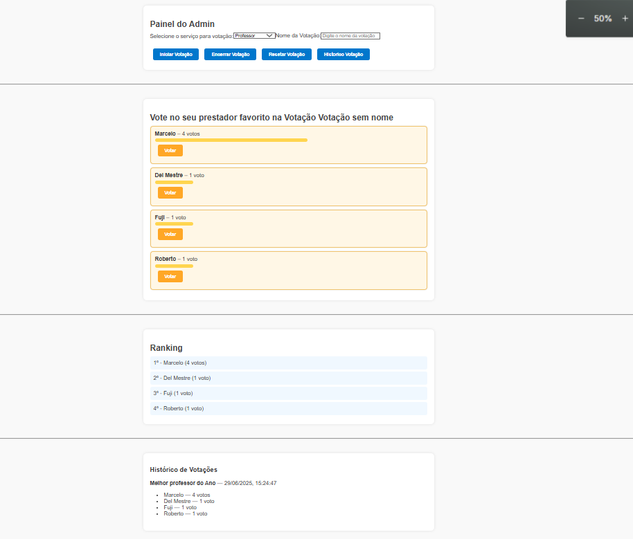

# 🗳️ Sistema de Votação ao Vivo por Categoria

Este projeto permite votações em tempo real entre prestadores de serviço, organizados por categoria. O administrador pode iniciar, encerrar e resetar votações, e os usuários podem votar e ver os resultados atualizados em tempo real usando **WebSockets**.

---

## 📁 Estrutura do Projeto

- votacao-app/ - Frontend em React
- votacao-backend/ - Backend com WebSocket Node.js


---

## ⚙️ Pré-requisitos

- Node.js (https://nodejs.org/)
- npm (gerenciador de pacotes que vem com o Node.js)

---

## 🚀 Como Rodar o Projeto

### 1. Clone este repositório

```bash
git clone https://github.com/Sweetrin0t7/ProjetoWebSocketsFront.git
cd seu-repo 
```

### 2. Instale e inicie o servidor WebSocket (backend)
```bash
cd votacao-backend
node server.js
```

### 3. Instale e inicie o frontend React
```bash
cd votacao-app
npm install
npm start
```
A aplicação frontend abrirá automaticamente em http://localhost:3000

## 🛠️ Tecnologias Utilizadas
- React
- WebSocket API (nativo do navegador)
- Node.js (servidor WebSocket)
- HTML e CSS

## 📸 Prints


# 🧩 Funcionalidades
### 👩‍💼 Admin:
- Seleciona o serviço da votação
- Define o nome da votação
- Inicia, encerra e reseta a votação
- Visualiza o histórico de votações anteriores

### 🙋‍♂️ Usuário:
- Visualiza prestadores do serviço ativo
- Vota em prestadores
- Acompanha o ranking em tempo real